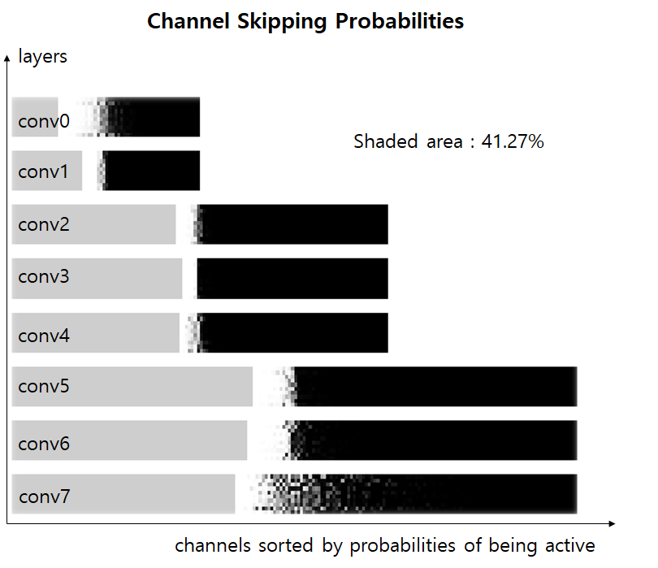

# FBS
PyTorch Implementation of the paper 'Dynamic Channel Pruning : Feature Boosting and Suppression' (ICLR 2019)

### Requirements
* Python 3.6 >
* PyTorch 1.4 >
* torchvision 0.5 >
* numpy, matplotlib, pandas

### Implementation Details
* Dataset: CIFAR-10 (Normalized)
* Model: M-CifarNet
* Lambda: 1e-8
* Batch Size: 256
* Optimizer: Adam(1e-3)
* Training rule: early stop on test accuracy
* Calculate MACs only for convolutional layers.

### Results

  
  

### References
[1] Gao, Xitong, et al. "Dynamic channel pruning: Feature boosting and suppression." arXiv preprint arXiv:1810.05331 (ICLR 2019).
[2] Ju Hyuk Lee (sehkmg), FBS-torch, GitHub Repository, 2020. (https://github.com/sehkmg/FBS-torch)
